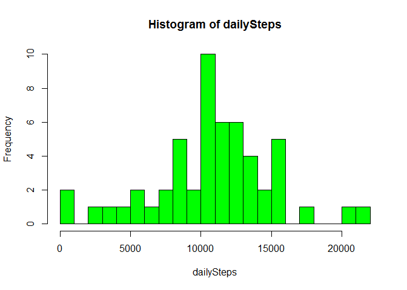
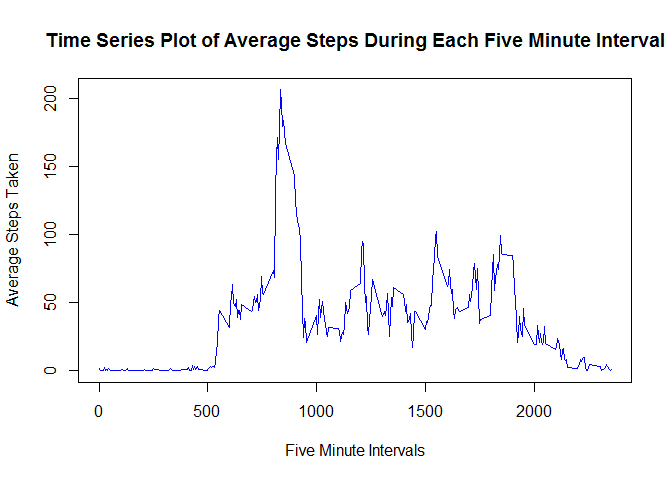
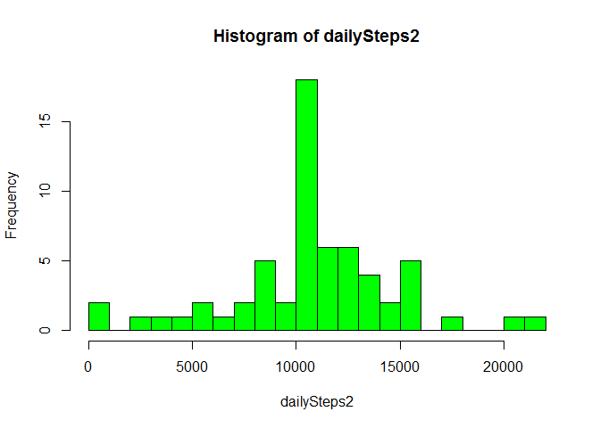
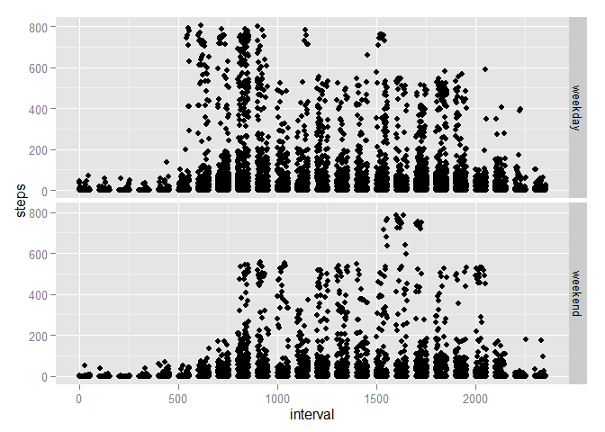

# Reproducible Research: Peer Assessment 1

## Introduction

It is now possible to collect a large amount of data about personal movement using activity monitoring devices such as a Fitbit, Nike Fuelband, or Jawbone Up. These type of devices are part of the "quantified self" movement - a group of enthusiasts who take measurements about themselves regularly to improve their health, to find patterns in their behavior, or because they are tech geeks. But these data remain under-utilized both because the raw data are hard to obtain and there is a lack of statistical methods and software for processing and interpreting the data.

This assignment makes use of data from a personal activity monitoring device. This device collects data at 5 minute intervals through out the day. The data consists of two months of data from an anonymous individual collected during the months of October and November, 2012 and include the number of steps taken in 5 minute intervals each day.


## Loading and preprocessing the data

First we load the activity data.


```r
activity = read.csv("activity/activity.csv")
```

We convert the dates to "Date" class objects.


```r
activity$date = as.Date(activity$date)
```

## What is mean total number of steps taken per day?

We apply the tapply function to the steps variable, over the factor variable date, to obtain the number of steps taken each day.  For this part, the missing values are ignored.


```r
dailySteps = tapply(activity$steps, activity$date, sum)
dailySteps
```

```
## 2012-10-01 2012-10-02 2012-10-03 2012-10-04 2012-10-05 2012-10-06 
##         NA        126      11352      12116      13294      15420 
## 2012-10-07 2012-10-08 2012-10-09 2012-10-10 2012-10-11 2012-10-12 
##      11015         NA      12811       9900      10304      17382 
## 2012-10-13 2012-10-14 2012-10-15 2012-10-16 2012-10-17 2012-10-18 
##      12426      15098      10139      15084      13452      10056 
## 2012-10-19 2012-10-20 2012-10-21 2012-10-22 2012-10-23 2012-10-24 
##      11829      10395       8821      13460       8918       8355 
## 2012-10-25 2012-10-26 2012-10-27 2012-10-28 2012-10-29 2012-10-30 
##       2492       6778      10119      11458       5018       9819 
## 2012-10-31 2012-11-01 2012-11-02 2012-11-03 2012-11-04 2012-11-05 
##      15414         NA      10600      10571         NA      10439 
## 2012-11-06 2012-11-07 2012-11-08 2012-11-09 2012-11-10 2012-11-11 
##       8334      12883       3219         NA         NA      12608 
## 2012-11-12 2012-11-13 2012-11-14 2012-11-15 2012-11-16 2012-11-17 
##      10765       7336         NA         41       5441      14339 
## 2012-11-18 2012-11-19 2012-11-20 2012-11-21 2012-11-22 2012-11-23 
##      15110       8841       4472      12787      20427      21194 
## 2012-11-24 2012-11-25 2012-11-26 2012-11-27 2012-11-28 2012-11-29 
##      14478      11834      11162      13646      10183       7047 
## 2012-11-30 
##         NA
```

A histogram of the total daily steps follows.


```r
hist(dailySteps, col = "green", breaks = 25)
```

 

The mean and median of the total number of steps taken each day are: 


```r
mean(dailySteps, na.rm = TRUE)
```

```
## [1] 10766.19
```

```r
median(dailySteps, na.rm = TRUE)
```

```
## [1] 10765
```

## What is the average daily activity pattern?

We want the average over all days in the two months of the number of steps taken during each five minute interval of a day.  We compute this using the tapply function below, then make a time series plot of the number of steps taken, on average, over each five minute interval.


```r
intervalAvg = tapply(activity$steps, activity$interval, mean, na.rm = TRUE)
intervals = levels(factor(activity$interval))
plot(intervals, intervalAvg, type = "l", col = "blue", main = "Time Series Plot of Average Steps During Each Five Minute Interval", xlab = "Five Minute Intervals", ylab = "Average Steps Taken", lwd = 1.5)
```

 

The interval with the highest average number of steps taken over the two months is:


```r
maxAvgSteps = max(intervalAvg, na.rm = TRUE)
maxIndex = intervalAvg == maxAvgSteps
intervals[maxIndex]
```

```
## [1] "835"
```

So the time interval when the most steps are taken, on average, is the interval 8:35 - 8:40 am.  The average number of steps during this interval is about 206.

## Imputing missing values

There are a number of missing values in the data for the number of steps taken in a given interval on certain days.  To determine how many rows with missing values, we compute:


```r
sum(is.na(activity$steps))
```

```
## [1] 2304
```

So there are 2304 rows with missing values.  We will replace these missing values with the average steps taken during the corresponding five minute interval.


```r
completeActivity = activity
for (i in 1:length(activity[,1])){
     if(is.na(completeActivity$steps[i])){
          timeInt = as.character(completeActivity$interval[i]) == intervals
          completeActivity$steps[i] = intervalAvg[timeInt]
     }
}
```

We make a histogram of the data with the missing values filled in.


```r
dailySteps2 = tapply(completeActivity$steps, completeActivity$date, sum)
hist(dailySteps2, col = "green", breaks = 25)
```

 

The mean and median of the total number of steps taken each day are: 


```r
mean(dailySteps2)
```

```
## [1] 10766.19
```

```r
median(dailySteps2)
```

```
## [1] 10766.19
```

These values differ from the first analysis where we ignored the missing values.  Note that the histograms show a more central values in the second analysis.  The mean has not changed, but the median changed to the same value as the mean in the second analysis.

## Are there differences in activity patterns between weekdays and weekends?

First we will create a new factor variable in the dataset with the missing variables removed.  The variable will indicate if the date is a weekday or a weekend.


```r
weekDay = weekdays(completeActivity$date)
is.weekday = (weekDay == "Monday" | 
               weekDay == "Tuesday" | 
               weekDay == "Wednesday" | 
               weekDay == "Thursday" | 
               weekDay == "Friday")
weekDayEnd = function(x){
     if (x) {
          "weekday"
     }
     else{
          "weekend"
     }
}
weekDay = unlist(lapply(is.weekday, weekDayEnd))
completeActivity$weekday = factor(weekDay)
```

To analyze the how the steps taken during weekdays differ from those taken during weekends, we make a panel plot containing two time series plots of the 5-minute interval (x-axis) and the average number of steps taken, averaged across all weekday days or weekend days (y-axis).


```r
library(ggplot2)
qplot(interval, steps, data = completeActivity, facets = weekday ~ ., type = "l")
```

 
